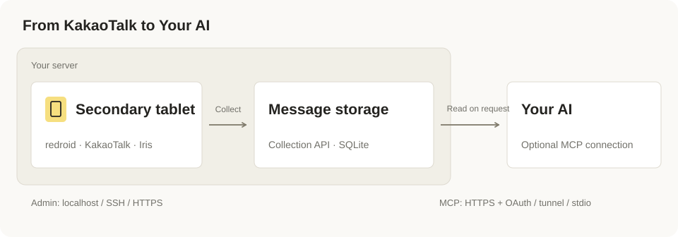

<div align="center">


<h1>KakaoTalk Bridge</h1>

**Connect your KakaoTalk messages to AI agents.**

KakaoTalk Bridge runs KakaoTalk headlessly on your server using redroid as a virtual Android tablet.<br>It collects messages from this secondary device and makes them available to AI agents through MCP.

[Get started](#getting-started) · [Connect your AI](#connect-your-ai) · [Documentation](#documentation) · [Contributing](CONTRIBUTING.md)

</div>

Iris reads the tablet's local message database and stores the collected messages on your server. Run the stack with Docker Compose, use the web admin console to install and sign in, then connect your AI client.

Use a [passkey](docs/passkeys.md) for admin and MCP connection approval. The default HTTPS/OAuth connection needs no developer account, client secret or separate authentication server. The optional OpenAI tunnel needs an OpenAI tunnel ID and runtime API key.

## See it in action

An illustrative conversation using synthetic messages:

```text
Collected messages
  “Friday meetup is at 7 PM.”
  “Friday meetup moved to 7:30 PM.”

You
  Find my collected messages mentioning "Friday" and summarize the plan.

Your AI
  Friday's meetup is now at 7:30 PM, updated from 7 PM.
```

The AI client searches through MCP and writes the summary from the retrieved messages. The bridge supplies the data. You can also ask it to retrieve recent collected messages or check collection status.

- **No physical tablet.** redroid runs the secondary Android device on your server.
- **Storage you control.** Messages are stored on your infrastructure, with a default 30-day retention period.
- **Read-only KakaoTalk access through MCP.** Agents can retrieve and search messages; no message-sending or tablet-control tools are exposed.

## Where does it run?

<p align="center">
  
</p>

Messages and the KakaoTalk session are stored in server volumes. Retrieved content is sent to your connected AI client. Admin and MCP share one HTTPS address on port 443: `/admin/` requires passkey sign-in and `/mcp` requires OAuth. See [Architecture](docs/design.md) and [Security](docs/security.md).

Run Redroid in a dedicated VM. Its available official images have old Android security patches; authenticated ADB and service isolation reduce exposure but do not remove that [remaining risk](docs/security.md#dependency-results-and-remaining-android-risk).

## Getting started

From the downloaded project folder, run:

```bash
bash install.sh
```

The installer prepares the execution environment, starts your bridge and opens the
setup page. Run the same command again to resume or reopen it. See the
[one-command setup guide](docs/quickstart.md) for download installation, Windows
entry points, supported environments and the remaining first-use confirmations.

1. **Open your bridge.** Follow the installer's browser sign-in and save a [passkey](docs/passkeys.md). Device preparation runs automatically. Install KakaoTalk through the on-screen store; collection components are then configured automatically.
2. **Sign in through the admin console.** Follow the [first login procedure](docs/web-ui.md#first-login). Select the secondary-device option and manually confirm that your phone's existing session remains active before starting collection.
3. **Connect your AI client.** Choose an [MCP connection method](#connect-your-ai) below.
4. **Try your first query.** Send yourself the two sample messages above from your phone, then ask your connected agent to find messages mentioning `Friday`. Confirm that both messages appear before asking for a summary.

> **Before signing in:** the login check currently recognizes the Korean KakaoTalk UI. Do not proceed if “Use with other devices” (“다른 기기와 함께 사용”) is missing or KakaoTalk asks to transfer the primary device. Phone sessions are not monitored automatically.

**Updating an existing server?** The security update requires one admin sign-in with your existing passkey. Registered passkeys and MCP connections are retained. Follow the [upgrade notes](docs/operations.md#upgrading-to-the-security-update) for the Iris migration and public proxy change.

## Connect your AI

| Connection | Setup | Validation |
| --- | --- | --- |
| Remote MCP over HTTPS with OAuth | [Server deployment and ChatGPT connection](docs/dot-plugin.md) | Passkey connection and profile/status calls verified; message retrieval confirmed by user testing. Event execution remains unverified |
| Personal OpenAI Secure MCP Tunnel | [Outbound-only MCP setup](docs/openai-tunnel.md); keep admin HTTPS reachable by your browser | Local auth, protocol, tools and event tests; live OpenAI connection unverified |
| stdio MCP launched by your client | [Configuration example](docs/api.md#stdio-mcp) | Automated protocol tests; verify compatibility with your client |

[MCP Events](docs/events.md) are optional and require a separate subscription. Connecting a client does not create subscriptions or automated tasks.

## Requirements and validation

| Environment | Requirements | Validation |
| --- | --- | --- |
| Apple Silicon Mac | Lima Ubuntu VM; Docker Engine inside the VM | Secondary login and Iris collection verified end to end |
| Linux amd64 | Docker Engine, Compose v2, Android binder kernel support | Image builds and API startup verified; KakaoTalk/redroid flow unverified |
| Other Linux arm64 hosts | Docker Engine, Compose v2, Android binder kernel support | Not verified outside the Apple Silicon Lima setup |

The Linux guide suggests starting with 4 vCPUs and 8 GB RAM; these are not measured minimums. The supplied Lima VM uses 6 CPUs and 8 GiB RAM. See [Validation scope](docs/implementation.md) for the tested environment and remaining checks.

The installer has isolated tests. A fresh installation through the CLI and the release publishing workflow still need end-to-end validation; `bridge up` builds source until you supply a verified prebuilt release manifest. Windows currently uses an existing Linux server or a Binder-enabled WSL2 distribution; it is not a verified native Android host.

## Collection scope

- Reads message bodies, types, times and conversation/sender IDs still present in the tablet database. [Message queries](docs/mcp-queries.md) add supported local display names, time filters and surrounding conversation context. Resumes from the last stored position after an interruption.
- Does not restore the phone's entire chat history, retrieve original attachments, or synchronize edits and deletions.
- Opening a conversation manually in the web admin console may change its KakaoTalk read status.

## Documentation

| Task | Documentation |
| --- | --- |
| Install and sign in | [One-command setup](docs/quickstart.md), [Advanced installer](docs/onboarding.md), [Linux](docs/install.md), [Mac](docs/local-redroid.md), [Admin console](docs/web-ui.md) |
| Configure administrator access | [Passkey setup and recovery](docs/passkeys.md) |
| Connect an AI client or use the API | [OAuth MCP](docs/dot-plugin.md), [Personal OpenAI tunnel](docs/openai-tunnel.md), [HTTP API and stdio MCP](docs/api.md), [Events](docs/events.md) |
| Check status, restart, and back up | [Operations](docs/operations.md), [Security](docs/security.md) |
| Understand, change, and verify the implementation | [Architecture](docs/design.md), [Iris](docs/iris.md), [Development](docs/development.md), [Validation scope](docs/implementation.md) |

## Contributing

Bug reports, documentation improvements, and compatibility results are welcome. See [Contributing](CONTRIBUTING.md) for reporting guidelines and [Development](docs/development.md) for local checks and previews.

## License and attribution

A project-wide license has not yet been specified. The modified Iris build has its own licensing and source-distribution requirements; see [NOTICE](iris/NOTICE.md). This project is not an official Kakao service.
