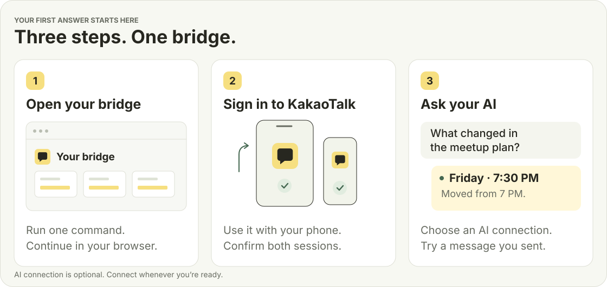
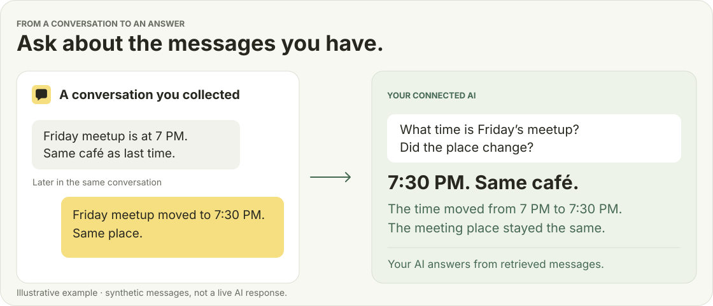
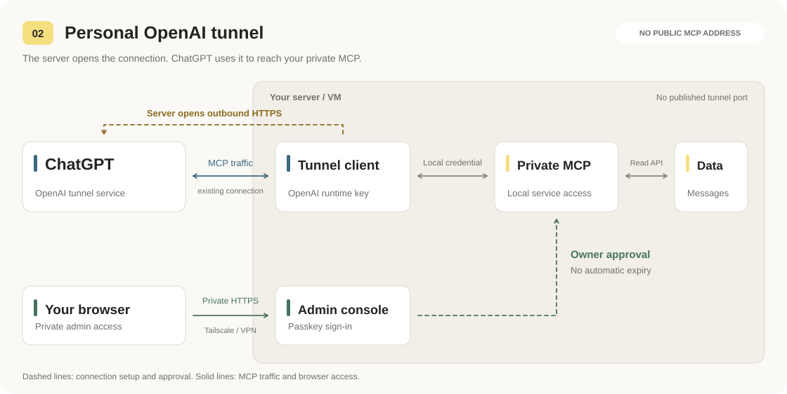
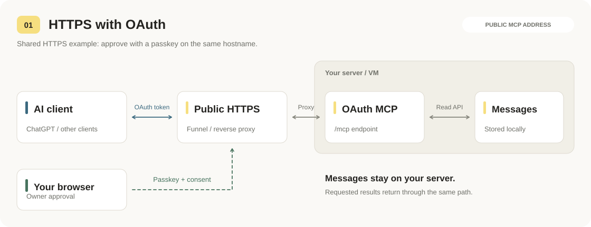
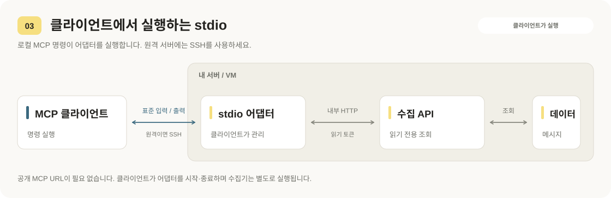
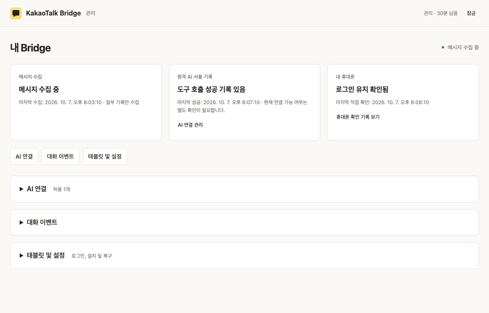

<div align="center">


<h1>KakaoTalk Bridge</h1>

카카오톡 메시지를 AI에서 검색·분석하고 보낼 수 있는 MCP 서버입니다.

직접 호스팅 · 브라우저에서 설정 · 메시지 조회·전송

[가상 태블릿을 쓰는 이유](#why-a-virtual-tablet) · [시작하기](#getting-started) · [첫 질문 해보기](#try-your-first-question) · [AI 연결하기](#connect-your-ai) · [사용 안내](#documentation)

</div>

<a id="why-a-virtual-tablet"></a>
## 왜 가상 태블릿인가요?

**카카오톡은 개인 대화방의 메시지를 조회·수신하는 공개 API를 제공하지 않습니다.** 공식 메시지 API는 발송용이며, 기존 대화를 가져오는 용도가 아닙니다. [카카오의 API 안내](https://devtalk.kakao.com/t/api/139501)

카카오톡은 같은 계정으로 동시 로그인할 수 있는 기기를 제한합니다. 수집용 Android를 주 기기로 로그인하면 기존 휴대폰에서 로그아웃될 수 있습니다. 휴대폰과 함께 쓰려면 태블릿에서 **다른 기기와 함께 사용**을 선택해 로그인해야 합니다.

Bridge는 redroid로 가상 Android 태블릿을 띄우고 카카오톡과 Iris를 실행합니다. Iris로 태블릿의 메시지 DB를 읽어 서버에 저장하고 MCP로 제공합니다. 실물 태블릿은 필요하지 않습니다. [수집 구조와 로그인 조건](docs/iris.md#components-and-assumptions)

<a id="getting-started"></a>
## 시작하기

Apple Silicon Mac 또는 Linux 서버의 터미널에서 실행하세요. [실행 환경](#requirements-and-validation)

```bash
curl -fsSL https://raw.githubusercontent.com/rokrokss/kakaotalk-bridge/main/install.sh | bash
```

끝나면 브라우저에 관리 화면이 열립니다. 이후에는 어느 폴더에서나 `kakaotalk-bridge doctor`처럼 명령을 실행합니다. 이미 설치했다면 같은 설치 명령이 설치 형태에 맞게 최신 버전으로 업데이트합니다. 화면 없는 서버는 [SSH 설치](docs/quickstart.md#local-and-ssh-admin-access)를 보세요.

<p align="center">
  <picture>
    <source media="(max-width: 600px)" srcset="docs/assets/readme-journey-mobile.svg">
    
  </picture>
</p>

1. **카카오톡 설치:** 패스키를 만들고, 태블릿의 스토어(Aurora)에 익명으로 로그인해 **Kakao Corp.의 카카오톡**을 설치하세요.
2. **로그인과 수집:** **다른 기기와 함께 사용**을 선택해 로그인하고, 휴대폰 로그인이 유지되는지 확인한 뒤 **메시지 수집 시작**을 누르세요.
3. **[AI 연결](#connect-your-ai) (선택):** **AI 연결 → AI 연결 설정**에서 사용할 곳을 고르세요.

> **다른 기기와 함께 사용** 옵션이 없거나 기기 이전을 요구하면 멈추세요. 휴대폰 카카오톡이 로그아웃될 수 있습니다.

[설치와 실행 가이드 →](docs/quickstart.md) · [화면별 상세 →](docs/web-ui.md#first-login)

<a id="try-your-first-question"></a>
## 첫 질문 해보기

수집을 시작하고 [AI를 연결한 뒤](#connect-your-ai), 휴대폰에서 나에게 아래 예시처럼 메시지를 보내세요. AI에 모임 시간과 장소를 물어보고 두 메시지를 모두 찾는지 확인하세요.

<p align="center">
  <picture>
    <source media="(max-width: 600px)" srcset="docs/assets/readme-example-mobile.svg">
    
  </picture>
</p>

**대화 요약**, **키워드·날짜별 메시지 검색**, **수집 상태 확인**도 요청할 수 있습니다. 전송 권한을 설정하면 "이 방에 7시에 도착한다고 보내줘"처럼 기존 대화방에 텍스트를 보낼 수 있습니다. [메시지 전송 안내](docs/sending.md)

<a id="connect-your-ai"></a>
## AI 연결하기

**AI 연결 → AI 연결 설정**에서 메시지를 사용할 곳을 선택하세요. 여러 연결 방식을 함께 사용할 수 있습니다.

| 사용하려는 환경 | 관리 화면에서 선택 | 필요한 것 |
| --- | --- | --- |
| 공개 서버 주소 없이 ChatGPT 사용 | **ChatGPT → 개인 터널** | OpenAI 터널 ID와 실행용 API 키. [터널 안내](docs/openai-tunnel.md) |
| HTTPS로 ChatGPT 또는 다른 원격 AI 연결 | **기존 HTTPS 주소** 또는 **Tailscale로 주소 만들기** | 설정된 HTTPS 프록시 또는 Tailscale Funnel. [HTTPS 안내](docs/dot-plugin.md) |
| 내 컴퓨터의 AI 앱 | **내 컴퓨터의 AI 앱** | MCP 명령을 실행할 수 있는 클라이언트. 원격 서버라면 SSH 접근 권한. [클라이언트 설정](docs/api.md#stdio-mcp) |

설정을 저장한 뒤 [AI 앱에서도 연결을 추가하세요](docs/web-ui.md#finish-in-your-ai-client).

<a id="how-the-connection-methods-work"></a>
## 연결 방식별 동작

### 개인 OpenAI 터널

서버에서 OpenAI로 연결하므로 공개 MCP 주소가 필요하지 않습니다.



### HTTPS와 OAuth

AI가 공개 MCP 주소로 연결하며, OAuth 승인 후 메시지에 접근합니다.



### 로컬 또는 SSH를 통한 stdio

AI 앱이 내 컴퓨터 또는 SSH를 통해 Bridge 어댑터를 실행합니다.



[구조](docs/design.md) · [편집 가능한 연결도](docs/assets/connection-methods.drawio)

<a id="your-everyday-view"></a>
## 관리 화면

수집 상태, 원격 AI 사용 기록, 휴대폰을 마지막으로 확인한 시각을 볼 수 있습니다.

<p align="center">
  
</p>

*가상 데이터를 표시한 관리 화면입니다.*

새 메시지 이벤트를 사용하려면 **대화 이벤트**에서 해당 대화를 **허용**하고 AI에도 구독을 요청하세요. [이벤트 설정과 제한 →](docs/events.md)

<a id="requirements-and-validation"></a>
## 실행 환경

| 실행 환경 | 지원 조건과 검증 상태 |
| --- | --- |
| Apple Silicon Mac | 전용 Lima Linux VM을 사용하며 Docker Desktop은 필요하지 않습니다. |
| Linux amd64 / arm64 | 전용 호스트 또는 VM에 Docker Engine, Compose v2, Android Binder가 필요합니다. 검증된 Mac/Lima 환경 밖의 카카오톡·redroid 호환성은 아직 확인하지 않았습니다. |
| Windows | 기존 Linux 서버 또는 Binder를 지원하는 WSL2가 필요합니다. Windows에서의 실행은 아직 검증하지 않았습니다. |

Mac VM에는 CPU 6개와 메모리 8 GiB가 설정됩니다. 측정된 최소 사양은 아닙니다.
[환경별 설치 안내](docs/quickstart.md#platforms) · [검증 내역](docs/implementation.md)

<a id="your-data-and-collection-scope"></a>
## 데이터와 수집 범위

- **보관:** 수집한 메시지는 설치한 서버에 기본 30일간 보관하며, 요청한 결과는 연결한 AI에 전달됩니다.
- **권한:** MCP는 검색·조회와 별도 권한의 텍스트 전송을 지원합니다. 태블릿 조작 도구는 제공하지 않습니다.
- **수집 범위:** 보조 태블릿에 표시되는 메시지만 수집합니다. 휴대폰 전체 기록, 원본 첨부파일, 수정·삭제 동기화는 지원하지 않습니다.
- **읽음 상태:** 태블릿에서 대화를 열면 읽음 상태가 바뀔 수 있습니다.

공식 redroid 이미지의 Android 보안 패치가 오래되었으므로 전용 호스트 또는 VM을 사용하세요.
[보안과 남은 위험](docs/security.md) · [수집 방식](docs/iris.md)

<a id="documentation"></a>
## 사용 안내

| 하고 싶은 일 | 읽을 문서 |
| --- | --- |
| 설치하고 로그인하기 | [빠른 시작](docs/quickstart.md) · [관리 화면](docs/web-ui.md) |
| AI 연결하기 | [OpenAI 터널](docs/openai-tunnel.md) · [HTTPS/OAuth](docs/dot-plugin.md) · [로컬/SSH 클라이언트](docs/api.md#stdio-mcp) |
| 메시지 보내기 | [전송 권한·상태·제한](docs/sending.md) |
| 이벤트를 보낼 대화 선택하기 | [MCP Events](docs/events.md) |
| 접근 관리·업데이트·복구 | [패스키](docs/passkeys.md) · [운영](docs/operations.md) |
| 배포 또는 내부 기능 개발 | [고급 설치](docs/onboarding.md) · [구조](docs/design.md) · [개발](docs/development.md) |

기존 설치는 설치 명령을 다시 실행해 업데이트합니다. [기존 설치 업데이트](docs/operations.md#update)
[기여하기](CONTRIBUTING.md)

<a id="license-and-attribution"></a>
## 라이선스와 출처

이 저장소는 [MIT 라이선스](LICENSE)로 제공합니다. 단, `iris/` 코드를 원본 Iris와 함께 빌드한 Iris APK에는 원본의 GPL-3.0 파일이 포함되므로 APK 전체에 GPL-3.0 조건이 적용됩니다. [라이선스 및 소스 배포 조건](iris/NOTICE.md)
KakaoTalk Bridge는 카카오의 공식 서비스가 아닙니다.
