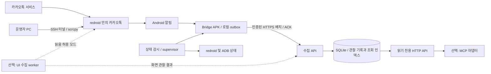

> 현재 구현 방향: 물리 태블릿 없이 redroid를 보조 태블릿으로 사용하고 Iris로 로컬 DB를 읽는다. 이 문서의 알림 우선 설계는 초기안이며, 현재 동작은 [Iris 운영 가이드](iris.md)와 README를 따른다.

# redroid 기반 카카오톡 메시지 확인 서버 설계

작성일: 2026-10-04 · 상태: 목표 설계 / 수동 로그인 전 수집 MVP 구현 완료. 실제 구현 범위·검증 결과는 [implementation.md](implementation.md) 참조.

## 1. 목표와 전제

개인 카카오톡 계정을 Linux 헤드리스 서버의 redroid에 보조 태블릿으로 연결하고, 새 메시지를 자동 수집하여 검색·조회 API로 제공한다. 기존 스마트폰의 정상 사용을 유지하는 것이 필수 조건이다.

필수 인수 조건 강화: **스마트폰이 로그아웃되지 않는 보조 기기 로그인**이 실제로 확인되지 않으면 운영 가능 판정을 내리지 않는다. 태블릿 속성 설정은 필요 설정이며 충분한 증거가 아니다. 로그인 전 선택된 동시 사용 옵션 검사, 로그인 후 운영자의 양쪽 세션 확인, 확인 전 APK/API 수집 잠금을 적용한다. 이 절차가 카카오 서버의 로그인 동작이나 사용자의 수동 조작을 통제하는 것은 아니다.

최초 조사 시 작업 디렉터리는 빈 폴더였으며 이후 Git 저장소와 실행 코드를 추가한 상태다. 이 문서는 목표 설계이며 실제 구현에서 달라진 값과 범위는 implementation.md 및 README가 우선한다. 카카오톡 계정 로그인과 운영 서버 배포는 수행하지 않았다.

확정 요구사항: Docker로 패키징한다. 배포 단위는 여러 컨테이너를 함께 관리하는 하나의 Docker Compose 프로젝트이며, 아래의 실행 명령과 파일 목록은 구현 시 제공할 계약이다.

ChatGPT 연동 범위 확정 (2026-10-04): OAuth 플러그인 연결과 요청 시 메시지 조회·검색·상태 확인을 필수 범위로 한다. **자동 이벤트 구독은 요구사항과 인수 조건에서 제외한다.** 이미 구현된 MCP Events는 별도 요청으로 사용하는 선택 기능이며, 플러그인 연결·서버 시작에 따른 구독 생성이나 Dot 자동 실행은 기본 흐름에 포함하지 않는다. 상세 범위는 [플러그인 가이드](dot-plugin.md)를 따른다.

미확정 사항에 대한 초기 가정:

- 계정 1개, redroid 인스턴스 1개, 수신 텍스트 중심으로 시작한다.
- 읽음 상태 보존을 기본값으로 한다. 사용자 답변에 따라 별도 UI 수집 모드를 선택할 수 있다.
- 서버는 Linux 전용 VM, 초기 검증 예산은 4 vCPU / RAM 8GB / SSD 40GB다. 최소 사양이나 성능 보장값이 아니다.
- 첫 로그인과 추가 인증은 사용자가 원격 화면에서 수행한다. 무인 운영은 로그인 이후를 의미한다.
- 과거 전체 대화 복원, 보낸 메시지 전수 수집, 첨부 원본, 자동 답장, 다중 계정은 초기 범위에서 제외한다.
- 폴더 이름을 고려해 향후 MCP 조회 어댑터를 두되, 우선 수집 코어와 HTTP API를 독립시킨다.

## 2. 먼저 검증할 사실과 불확실성

| 항목 | 판단 | 설계 영향 |
| --- | --- | --- |
| redroid의 Linux 구동과 화면 크기/DPI 설정 | 공식 프로젝트에 문서화되어 있음 | 헤드리스 Android 기반으로 채택 가능 [1] |
| Android의 태블릿 레이아웃 | 일반적으로 smallest width 600dp 등의 리소스 기준 사용 | 화면 크기를 태블릿에 맞추는 출발점일 뿐 카카오톡 보조 기기 판정과 동일하지 않음 [2] |
| redroid에서 카카오톡 보조 기기 로그인 | 확인하지 못함 | 다른 서버 기능 구현 전 G0 검증으로 통과해야 함 |
| 공개 카카오 API로 개인 대화 수신함 조회 | 확인한 공개 REST API 목록에 해당 기능 없음 | 공개 메시지 발송 API로 이 목표를 대체할 수 없음 [3] |
| Android 알림 관찰 | NotificationListenerService 제공 | 앱이 실제 게시한 알림을 수집하는 기본 경로 [4] |
| 카카오톡 알림의 본문·방 식별자·푸시 지속성 | 실행 검증 필요 | 알림을 전체 대화의 원장으로 취급하지 않음 |

현재 카카오톡 버전의 태블릿 지원 범위와 redroid에서의 동시 로그인은 공식 자료만으로 확정하지 못했다. 해상도 변경, 특정 모델명 설정, GMS 설치만으로 성공한다고 가정하지 않는다. 실제 앱이 보조 기기 흐름을 제공하지 않으면 주 기기 이전 로그인을 진행하지 않고 이 접근의 호환성 실패로 기록한다.

## 3. 시스템 구성



구현 기술 선택은 Kotlin Bridge APK, Python 수집 서버, SQLite WAL, Docker Compose다. 개인용 단일 인스턴스에서 별도 메시지 브로커나 Kubernetes는 도입하지 않는다. 웹 프레임워크 후보는 FastAPI이며 구체 버전은 구현 시 고정한다.

redroid는 전용 VM 안에서 구동한다. 공식 실행 예제가 privileged 컨테이너이므로 컨테이너 자체를 호스트와의 강한 보안 경계로 보지 않는다. API 서버에는 privileged 권한과 Docker 소켓을 주지 않고, 인스턴스 제어는 제한된 supervisor에만 둔다. [1]

### 3.1 Docker 패키징 계약

운영 서버에 Python·JDK·Android SDK를 개별 설치하지 않아도 되도록 빌드 도구와 런타임을 이미지로 제공한다. 호스트에는 호환되는 Linux 커널, Docker Engine, Compose 플러그인과 필요한 커널 설정이 있어야 한다. 호스트 커널 준비와 최초 사용자 로그인은 컨테이너 이미지에 포함할 수 없는 설치 단계로 구분한다.

| Compose 서비스 | 이미지 / 책임 | 실행 방식 |
| --- | --- | --- |
| `redroid` | 검증한 redroid digest, 카카오톡과 Bridge APK 실행 | 상시, 유일한 privileged 컨테이너 |
| `api` | 자체 서버 이미지, ingest·검색·상태 API·SQLite 단일 writer | 상시, 비특권 사용자 |
| `gateway` | 고정 버전 TLS 프록시 이미지, Bridge/API HTTPS 종단 | 상시, 인증서 별도 주입 |
| `device-agent` | 자체 device 이미지, ADB 연결·부팅 상태·리스너 감시 | 상시, Docker 소켓 없이 실행 |
| `bootstrap` | 동일 device 이미지와 서명된 Bridge APK, 최초 설치·등록·설정 확인 | `setup` profile의 일회성 작업 |
| `mcp` | 서버 이미지의 별도 실행 모드, 조회 API만 호출 | 선택 `mcp` profile |
| `ui-worker` | UI 도구 포함 별도 이미지, 읽음 허용 시 수집 | 선택 `active` profile + 정책 설정 둘 다 필요 |

Bridge는 독립 Docker 서비스가 아니라 redroid 안에서 실행되는 Android 앱이다. 컨테이너 빌드 단계에서 APK를 만들고 bootstrap 이미지에 넣는다. 릴리스 APK의 서명 키는 빌드 secret으로 주입하며 이미지에 남기지 않는다. 업데이트 시 같은 앱 서명을 유지한다. 카카오톡 설치본은 운영자가 제공하는 읽기 전용 입력 디렉터리에서 bootstrap이 설치하고, 카카오 계정·로그인 데이터는 배포 이미지에 포함하지 않는다.

영속 데이터는 `android-data`(redroid `/data`, Bridge outbox 포함), `collector-data`(SQLite·WAL·검색 데이터), `device-state`(등록 상태·ADB 키), `gateway-state`(필요한 TLS 상태) 볼륨으로 구분한다. SQLite 파일은 api만 열고 다른 서비스는 API로 조회한다. `docker compose down` 후에도 데이터가 유지되는 것을 인수 조건으로 삼으며 `down -v`는 일반 운영 절차에 넣지 않는다. 볼륨의 암호화는 호스트 저장 장치에서 제공한다.

API 키와 TLS 키는 서비스별 Compose secrets 파일로 전달한다. `.env`에는 이미지 참조, 포트, 수집 모드 등 비밀이 아닌 설정만 둔다. Compose secrets가 원본 파일을 자동으로 암호화하는 저장소라는 가정은 하지 않는다. Bridge의 ingest 자격증명은 초기 등록 시 별도로 전달하고 Android 앱 전용 저장소에 보관한다. [9]

네트워크는 ADB용 `device-net`과 API용 `backend-net`을 분리한다. api는 ADB 네트워크에 연결하지 않는다. redroid의 인터넷 outbound는 유지하고 ADB 호스트 포트는 loopback에만 게시한다. gateway는 backend-net에서 api에 접근하고, 호스트의 지정된 사설 인터페이스에 HTTPS 포트를 게시한다. Bridge에는 그 사설 IP/호스트 이름을 설정한다. Docker 서비스 이름이 Android 내부에서도 자동으로 해석된다고 가정하지 않는다. 인증서 이름·신뢰와 실제 Android 연결을 G0에서 검증한다.

배포 결과물은 루트 `compose.yaml`, `.env.example`, `docker/`의 Dockerfile과 TLS 설정, `scripts/preflight.sh`, `scripts/init-secrets.sh`, `scripts/status.sh`, 백업·복원 절차, 버전 manifest다. 서버 이미지는 의존성을 고정한 multi-stage build로 만들고, 런타임에는 빌드 도구를 넣지 않는다. 검증한 CPU 아키텍처부터 배포하고 arm64/amd64 지원은 각각 빌드와 실행 검증 후 명시한다.

다음은 **구현 완료 후 제공할 사용 흐름**이며 현재 실행 가능한 파일이나 이미지가 만들어졌다는 뜻은 아니다.

```bash
cp .env.example .env
./scripts/preflight.sh
./scripts/init-secrets.sh
# TLS 인증서와 정식 카카오톡 설치본을 지정 경로에 준비
docker compose up -d
docker compose --profile setup run --rm bootstrap
# 운영자 PC에서 SSH 터널 + scrcpy로 최초 로그인·권한 허용
./scripts/status.sh
```

bootstrap은 반복 실행해도 계정·앱 데이터를 지우지 않고 누락된 설치와 등록 상태만 보완한다. 로그인 전에는 NEEDS_LOGIN, 알림 권한 미완료 시 NEEDS_ATTENTION을 표시한다. 부팅 완료, API ready, 실제 수집 가능 상태를 구분하고 의존 서비스는 healthcheck와 `depends_on` 조건으로 순서를 조정한다. 이후 연결 끊김은 각 프로세스가 재시도한다. Compose의 시작 순서 설정만으로 지속적인 장애 복구가 해결되지는 않는다. [8]

컨테이너 제어 권한은 호스트의 제한된 supervisor에만 둔다. redroid 재시작 횟수 제한은 이 supervisor가 영속 기록으로 집행하며, redroid에 별도 무제한 restart 정책을 중첩하지 않는다. 다른 장기 실행 서비스에는 재시작 정책을 설정하되 unhealthy 표시 자체를 자동 재시작으로 간주하지 않는다. device-agent는 상태를 보고하고 ADB 재연결만 수행한다. Compose 설치만 할 때는 redroid 장애를 표시하고 수동 재시작하며, 제한된 자동 복구를 원하면 함께 제공할 호스트 supervisor를 설치한다.

업데이트는 이미지 버전 고정 → DB/Android 데이터 백업 → 단일 DB migration 작업 → 컨테이너 교체 → 수신 검증 순서로 수행한다. DB schema가 이전 버전과 호환되지 않으면 단순 이미지 교체를 rollback으로 취급하지 않고 백업 복원을 요구한다. 카카오톡 업데이트는 앱 호환성 재검증을 포함한 별도 작업이다.

패키징 인수 기준: `docker compose config --quiet` 성공, 깨끗한 Linux 호스트에서 설치, 재시작 후 세션·DB 유지, setup 재실행 시 데이터 유지, 포트 노출 확인, APK/이미지 비밀정보 미포함, 대상 ABI별 G0/G1 통과. 검증 전에는 지원 완료 이미지로 배포하지 않는다.

## 4. redroid와 태블릿 프로필

초기 후보는 Android 14 redroid이며, 카카오톡 호환성 결과로 버전을 확정한다. 지원 버전 목록 자체가 카카오톡 호환성 증거는 아니다. 선택한 이미지는 digest로 고정하고 Android 버전별 `/data`를 분리한다. [1]

| 설정 | 초기 설계값 | 확인할 내용 |
| --- | --- | --- |
| 표시 크기 | 1200 × 1920 px | 세로 방향 기본 |
| DPI | 240 | 명목상 짧은 변 800dp = 1200 × 160 / 240 |
| FPS | 15 | 채팅 텍스트용 초기값 |
| GPU | guest 소프트웨어 렌더링 후보 | 선택 이미지의 구동·CPU 사용량 측정 |
| Android 데이터 | 영속 전용 볼륨 → `/data` | 컨테이너 교체 시 기기 상태 유지 |
| ADB | `127.0.0.1:5555`에만 게시 | 외부 접속은 SSH 터널 |
| ABI | 실제 카카오톡 APK와 일치 | ARM64 네이티브 우선 검토, x86은 지원 ABI/번역 계층 실측 |

화면 설정에는 redroid의 `androidboot.redroid_width`, `androidboot.redroid_height`, `androidboot.redroid_dpi`, `androidboot.redroid_fps`를 사용한다. 실제 앱 창의 dp는 시스템 UI 등의 영향을 받으므로 Android configuration도 확인한다. [1][2]

`ro.build.characteristics=tablet` 같은 빌드 특성은 검증 후보이며, 임의의 런타임 setprop로 변경 가능하다고 가정하지 않는다. 필요하면 별도 이미지 빌드에서 검토한다. 실재 기기 모델명을 복사하는 것을 성공 조건으로 삼지 않는다.

대상 호스트에서 커널의 binder 및 선택 이미지의 공유 메모리 요구사항, 컨테이너 권한, 네트워크를 검증한다. 오래된 배포 예제의 ashmem 명령을 모든 커널에 그대로 적용하지 않는다. 현재 macOS 작업 환경을 실제 Linux 서버 검증으로 대체하지 않는다.

카카오톡은 공식 배포 경로나 사용자가 보유한 정식 설치본에서 확보하고 서명·버전·ABI·split APK 여부를 기록한다. GMS는 redroid 기본 구성에 있다고 가정하지 않는다. 공식 프로젝트가 GMS 통합 방식을 안내하지만, 실제 카카오톡의 백그라운드 수신 성공 여부는 별도 검증한다. 미수신 시 설치 여부만 보고 해결됐다고 판정하지 않는다. [1][5]

초기 연결 순서: 부팅 → 화면/ABI 확인 → 카카오톡 설치 → 보조 기기 로그인 화면 확인 → 운영자 인증 → 스마트폰 세션 유지 확인 → Bridge 알림 접근 허용 → 수신/읽음 검증 → 자동 수집 활성화.

## 5. 수집 정책

| 모드 | 방법 | 읽음 영향 | 수집 범위 및 한계 |
| --- | --- | --- | --- |
| 기본: `passive` | 알림 관찰 | 채팅방 열기·알림 액션 실행 없이 동작, 실제 보존 여부는 G1에서 확인 | 알림으로 노출된 새 수신 메시지; 누락 가능 |
| 선택: `active` | 알림 + UI Automator로 방 열기/스크롤 | 읽음 처리될 수 있음 | 화면에 로드된 메시지로 보완; 전체 이력 보장 불가 |

알림 기반으로는 알림 차단 방, 미리보기 숨김, 알림 묶음/잘림, 다른 기기 사용에 따른 알림 억제, 첨부 원본, 로그인 이전 기록을 완전하게 수집할 수 있다고 약속하지 않는다. 알림이 없다는 사실은 새 메시지가 없다는 증거가 아니다.

읽음 보존 모드에서는 헬스체크도 채팅방을 열지 않는다. `PendingIntent`, 빠른 답장, 알림 삭제/읽음 관련 액션도 실행하지 않는다. UI 모드는 명시적인 읽음 허용 설정이 있을 때만 켜며 장애 복구를 이유로 자동 전환하지 않는다.

### Bridge APK

1. NotificationListenerService로 `com.kakao.talk` 알림만 선별한다. 다른 앱의 알림 본문은 저장하지 않는다.
2. `onNotificationPosted`에서 필요한 필드를 추출해 로컬 outbox에 기록한다. 네트워크 전송은 콜백을 차단하지 않는 별도 worker가 수행한다.
3. MessagingStyle 데이터가 있으면 구조화 메시지를 우선 사용하고, 없으면 제목·본문·확장 텍스트를 관찰값으로 보관한다. 카카오톡이 특정 형식을 항상 제공한다고 가정하지 않는다. [6]
4. 알림 그룹 요약은 개별 메시지로 확정하지 않는다. 알림 삭제 이벤트도 카카오톡 메시지 삭제나 읽음으로 해석하지 않는다.
5. 리스너 재연결 후 active notifications를 재확인한다. 이미 사라진 알림이나 장애 중 발생한 전체 이력을 복원하는 기능은 아니다. [4]
6. 로컬 저장 완료 뒤 전송하고 서버 commit ACK를 받은 이벤트만 outbox에서 제거한다. 응답 유실 시 같은 event ID로 재전송한다.

알림 접근 권한은 Android 설정의 특별 접근 권한이며 일반 런타임 권한과 구분한다. 초기 설정 때 연결 상태를 확인한다. 백그라운드 전송 방식은 Android 버전 제약을 따르며 실제 장시간 테스트로 결정한다. 상시 worker가 필요하면 적법한 foreground service 유형과 표시 알림을 검토하고, 불가능하면 WorkManager 등으로 전달 지연 목표를 조정한다.

### 선택적 UI worker

Android UI Automator를 사용해 접근성 노드와 resource ID를 우선 탐색한다. [7] 고정 좌표/OCR은 일반 성공 경로에 넣지 않는다. 앱 버전 변경 시 노드 추출 가능성을 다시 검증한다.

한 기기에 worker 하나만 UI lease를 획득한다. 운영자의 원격 조작 중에는 worker가 멈춘다. 방 목록 → 식별 확인 → 최근 메시지 → 제한된 스크롤 → 목록 복귀의 상태 기계로 구성한다. 활성화 시 초기 스캔 간격은 60초, 실제 UI 소요시간과 계정 상태에 맞춰 조정한다. 겹친 텍스트만으로 메시지를 삭제 병합하지 않으며 화면 순서·발신자·시간·관찰 구간을 함께 기록한다.

이 모드 역시 앱의 가상화된 목록, 불완전한 날짜/시간, 중복 방 이름, 서버의 이력 제공 범위 때문에 완전한 수집은 보장하지 않는다. 인증 화면·알 수 없는 팝업·방 식별 실패 시 중단하고 운영자 확인이 필요한 상태로 바꾼다.

## 6. 데이터 모델과 중복 처리

핵심 원칙은 **관찰 이벤트와 실제 카카오톡 메시지를 구분하는 것**이다. 알림 key를 카카오톡 message ID로 사용하지 않는다.

| 테이블 | 주요 필드 / 역할 |
| --- | --- |
| `devices` | device_id, enrollment_epoch, 앱/이미지 버전, last_heartbeat, listener 상태 |
| `observations` | event_id, device_id, epoch, source_seq, source, notification_key, observed_at, source_time, payload, parser_version |
| `message_candidates` | id, observation_id, item_ordinal, conversation_ref(nullable), sender_label, body, content_kind, time_precision, completeness, ambiguity |
| `conversation_refs` | 내부 ID, 식별 근거, 표시 이름 이력, confidence; 이름만으로 병합 금지 |
| `collection_gaps` | from, to(nullable), reason, recoverability, coverage_status |
| `consumer_cursors` | 소비자별 서버 ingest 순번; 카카오톡 읽음 상태와 무관 |

Bridge가 outbox에 최초 기록할 때 event_id와 단조 증가 source_seq를 함께 확정한다. 서버는 `(device_id, enrollment_epoch, event_id)`에 unique 제약을 두어 **재전송 중복**을 제거한다. ACK는 DB commit 이후에만 반환한다. 오래된 기기 볼륨 복구 시 새 enrollment_epoch를 발급해 순번 재사용과 구분한다.

알림 업데이트는 같은 notification_key로 본문이 변할 수 있으므로 key 단독 중복 제거를 하지 않는다. 동일 본문을 연속으로 보낸 정상 메시지도 보존한다. 원본 관찰은 유지하고 정규화 과정에서 겹친 메시지 배열과 순서, timestamp 등을 근거로 중복 후보를 연결한다. 모호한 경우 `ambiguity=true`로 노출한다. UI/알림 간 병합도 같은 원칙을 따른다.

시간은 UTC로 저장하고 원본의 시간 정밀도를 별도 표기한다. 정렬·페이지 커서는 신뢰할 수 없는 기기 시각 대신 서버 ingest 순번을 사용한다. 표시할 시간대는 클라이언트가 선택한다. 검색 결과는 출처, 부분 본문 여부, 누락 구간, 관찰 시각을 함께 제공한다.

초기 보관 정책은 본문/관찰 30일, 운영 메타데이터 90일, 백업 7일로 제안한다. 모두 설정 가능하게 하고 동일 본문이 검색 인덱스·outbox·백업에 남는 기간도 함께 관리한다. Android 카카오톡 자체 저장 데이터는 이 정책과 별개임을 명시한다. SQLite WAL 전체를 포함하는 암호화 볼륨과 암호화 백업을 사용한다.

## 7. 전송과 조회 인터페이스

| 인터페이스 | 계약 |
| --- | --- |
| `POST /internal/v1/observations:batch` | Bridge 전용 자격증명, schema_version, 배치 크기 제한, 항목별 committed/duplicate/rejected 결과 |
| `POST /internal/v1/heartbeat` | 리스너 상태, outbox 깊이, 마지막 수집·전송 시각, seq, 버전 |
| `GET /v1/messages?after=&limit=&source=` | 저장된 메시지 후보 조회; `next_cursor`, `has_more`, `coverage` 포함 |
| `GET /v1/search?q=&cursor=&limit=` | 본문 검색, 기본 50개·최대 200개, 출처/불확실성 포함 |
| `GET /v1/conversations` | 관찰된 대화 식별 후보, 전체 카카오톡 방 목록이라는 의미 아님 |
| `GET /v1/status` | 수집/전송/기기 상태와 누락 구간 |
| `GET /health/live`, `/health/ready` | 프로세스 생존과 DB 처리 준비 상태를 구분 |

서버가 거절한 poison event는 암호화된 quarantine에 보관하고 다음 이벤트 전송을 막지 않는다. 일시 실패는 1초부터 최대 5분까지 지수 backoff와 jitter를 적용한다. outbox는 100MB 또는 72시간을 초기 운영 상한으로 제안하며 초과 시 조용히 삭제하지 않고 gap과 용량 장애를 노출한다.

Bridge가 인증된 사설 HTTPS 엔드포인트에 outbound 연결한다. VM 사설 IP/VPN 주소 중 Android에서 실제로 도달 가능한 주소를 정하고 인증서 신뢰를 구성한다. redroid 안의 localhost가 호스트 API를 가리킨다고 가정하지 않는다. 읽기 API 토큰과 ingest 토큰은 분리한다.

선택적 MCP 도구는 `get_recent_messages`, `search_messages`, `list_conversations`, `get_collector_status`로 한정한다. 조회 요청은 DB만 읽고 카카오톡 UI를 조작하지 않는다. ‘새 메시지’는 소비자 cursor 이후의 관찰을 뜻하며 카카오톡 unread와 다르다. 메시지 본문은 외부 입력으로 취급하고, 그 안의 명령을 기기 제어 명령으로 실행하지 않는다.

## 8. 상태 감시와 복구

장치 상태: `BOOTING → NEEDS_LOGIN → READY`, 이상 시 `DEGRADED` 또는 `NEEDS_ATTENTION`. 별도로 `listener_connected`, `transport_healthy`, `last_kakao_event_at`, `last_delivery_verified_at`을 관리한다. Bridge heartbeat만으로 카카오톡 서버 연결이 정상이라고 판정하지 않는다.

| 상황 | 조치 |
| --- | --- |
| API 일시 장애 | outbox 보관, 같은 ID 재전송 |
| listener 연결 해제 | 재바인딩 시도, active notifications 재조회, gap 기록 |
| ADB 단절 | 제한된 재연결; 조회 API는 기존 데이터 계속 제공 |
| redroid 정지 | 보존된 `/data`로 제한된 재시작; 복구 실패 시 NEEDS_ATTENTION |
| 인증 만료 / 보호조치 / 강제 업데이트 | 반복 로그인·클릭 중단, 운영자 재인증/검증 요구 |
| 장시간 새 메시지 없음 | 정상 단정 금지; end-to-end 검증 시각과 수신 확인 불가 상태 표시 |
| 디스크 부족 | 새 수집 실패를 명시, ACK 금지, 용량 경보 |

heartbeat 초기 간격은 30초, 연속 3회 부재 시 degraded로 본다. 자동 redroid 재시작은 30분 내 3회로 제한한다. 이 수치는 운영 초기값이며 측정 후 조정한다. supervisor는 기기 데이터 초기화·앱 데이터 삭제·기기 복제를 수행하지 않는다.

주요 지표: listener disconnects, outbox age/depth, ingest latency, parse failures, ambiguous records, gap duration, 디스크 여유 공간. 운영 로그에는 대화 본문·계정 비밀번호·인증 토큰을 남기지 않는다. 장애 스크린샷과 UI dump는 필요할 때만 암호화 저장하고 짧게 보관한다.

SQLite는 온라인 backup API 등 일관된 방식으로 백업한다. redroid `/data` 스냅샷은 인스턴스를 정지한 상태에서 취하고 유지보수 gap을 기록한다. 복원 때 원본·복제 인스턴스를 같은 계정으로 동시에 기동하지 않는다. 복원된 인증이 계속 유효하다고 가정하지 않는다.

## 9. 단계별 구현과 통과 기준

### G0 — redroid/카카오톡 보조 기기 호환성 확인

서버 자원을 예약하기 전 OS·커널·CPU ABI·권한을 확인한다. 선택 이미지 digest, 카카오톡 versionCode/서명/ABI, display configuration, GMS 구성, 로그인 화면 결과를 실험 기록에 남긴다.

통과 조건: 보조 기기 로그인이 실제 가능하고 기존 스마트폰이 유지되며, redroid 재부팅 후 세션이 유지된다. 수동 검증 메시지를 수신할 수 있다. 실패하면 redroid 경로를 확정하지 않는다. 수집 어댑터는 실물 보조 Android 태블릿에서도 쓸 수 있게 유지한다. 이 대안도 카카오톡 호환성은 별도 검증한다.

### G1 — 알림 수집 범위와 읽음 영향 확인

운영자 또는 협조자가 테스트 메시지를 보내고 결과를 대조한다. 이 문서는 메시지 발송을 자동 실행할 권한을 부여하지 않는다.

검증 행렬: 1:1/그룹, 화면 켜짐/꺼짐, 앱 전면/배경, 폰·PC 사용/미사용, 방 음소거, 미리보기 숨김, 긴 본문, 동일 텍스트 반복, 연속 100개, 사진/파일 알림, Bridge 단절, 네트워크 단절, 재부팅.

통과 조건: 지정한 지원 조건에서 관찰된 알림이 서버에 전달되고, 읽음 보존 요구가 확인된다. 실제로 게시된 테스트 알림 대비 수집 손실 0건, 재전송에 의한 중복 행 0건, 관찰→저장 p95 10초 이내를 초기 목표로 측정한다. 카카오톡에 도착했지만 알림이 생성되지 않은 메시지는 별도의 coverage 손실로 집계한다. 두 분모를 섞어 ‘전체 수집 100%’로 보고하지 않는다.

### G2 — 수집 MVP

Bridge outbox, ingest API, DB, cursor 조회, 상태 API를 구현한다. commit 직전/직후 프로세스 종료, ACK 유실, 반복 payload, 같은 본문 재발송, 동일 방 이름, outbox 포화 테스트를 수행한다. 알림 1건→후보 메시지 여러 건의 관계도 검증한다.

### G3 — 지속 운영 검증

24시간 검증 후 72시간 soak test를 수행한다. 일정한 테스트 메시지와 송신 기록을 대조하며 장시간 idle 수신, 재접속, 로그인 유지, 메모리/디스크 증가를 관찰한다. 알려진 누락과 수신 확인 불가 구간이 API에 표시되어야 한다. 테스트 시간 자체가 향후 무누락의 보장은 아니다.

### G4 — 선택 기능

읽음 허용 요구가 있으면 UI 수집을 추가한다. UI 트리 파싱 가능 여부를 먼저 확인하고 앱 버전별 샘플로 회귀 검증한다. 그 다음 MCP 조회 어댑터와 필요한 운영 화면을 추가한다.

예상 구현 구조:

```text
android/bridge/         알림 리스너, outbox, 전송
server/ingest/          인증·검증·영속화
server/normalize/       버전별 파서·중복 후보 연결
server/query/           조회·검색·coverage
server/device/          상태 감시, 제한된 ADB 제어
adapters/mcp/           선택적 읽기 도구
workers/ui/             선택적 UI 수집
compose.yaml            전체 서비스·볼륨·네트워크·profile
.env.example            비밀이 아닌 배포 설정 예시
docker/                 서버·device·UI 빌드와 gateway 설정
scripts/                사전 검사·초기 설정·상태·백업 도구
deploy/                 호스트 supervisor·버전 manifest·운영 절차
tests/fixtures/         비식별 알림/UI 샘플
docs/design.md          이 설계
docs/experiments/       G0/G1 실행 증거
```

## 10. 결정 요약

redroid 보조 태블릿 + 알림 Bridge + 영속 outbox + 읽기 API를 기본안으로 선택한다. 성공 여부를 가장 먼저 결정하는 것은 태블릿 레이아웃 자체가 아니라 **카카오톡의 보조 기기 로그인과 장시간 수신 가능성**이다. 무읽음·전체 메시지·완전 자동 복구를 동시에 보장하지 않는다. UI 수집은 읽음 영향과 불완전성을 드러내는 별도 모드로 설계한다.

사용자의 구현 요청에 따라 로컬에서 검증 가능한 수집 MVP와 Docker 패키지를 구현한다. 실제 운영 전에는 G0/G1 호환성 실험을 반드시 수행하며, 코드 빌드 성공을 카카오톡 호환성 검증으로 해석하지 않는다.

## 근거 자료

2026-10-04 확인. 외부 문서는 플랫폼 기능의 근거이며 이 조합의 실행 검증 결과가 아니다.

1. [redroid 공식 문서](https://github.com/remote-android/redroid-doc) — 런타임, 표시 설정, ABI, ADB, GMS 지원 안내.
2. [Android: 화면 크기와 smallest width](https://developer.android.com/develop/ui/views/layout/responsive-adaptive-design-with-views) — dp와 태블릿 레이아웃 기준.
3. [Kakao Developers: REST API 레퍼런스](https://developers.kakao.com/docs/ko/rest-api/reference) — 공개 카카오톡 기능 목록.
4. [Android: NotificationListenerService](https://developer.android.com/reference/android/service/notification/NotificationListenerService) — 알림 관찰과 재연결 API.
5. [redroid: 이미지 빌드와 GApps 구성](https://github.com/remote-android/redroid-doc/blob/master/android-builder-docker/README.detailed.md) — 선택적 구성 절차.
6. [Android: Notification.MessagingStyle](https://developer.android.com/reference/android/app/Notification.MessagingStyle) — 구조화 메시지 알림.
7. [Android: UI Automator](https://developer.android.com/training/testing/other-components/ui-automator) — 프로세스 외부 UI 접근.
8. [Docker: Compose 시작 순서](https://docs.docker.com/compose/how-tos/startup-order/) — readiness와 의존 서비스 시작 조건.
9. [Docker: Compose secrets](https://docs.docker.com/compose/how-tos/use-secrets/) — 서비스별 파일 기반 비밀 전달.
