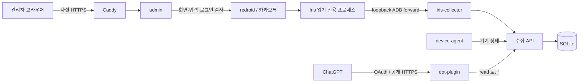

# 시스템 구조

[README](../README.md) · [Iris 구현](iris.md) · [API](api.md)

계정 하나와 redroid 인스턴스 하나를 운영합니다. 저장소의 기본 수집 경로는 Iris입니다. 초기 알림 기반 설계와 구현 이력은 Git 기록에 남아 있습니다.

## 서비스 경계

| 서비스 | 책임 |
| --- | --- |
| `redroid` | Android 실행. 유일한 privileged 컨테이너 |
| `iris-collector` | Android 내부 Iris 프로세스 확인, 행 조회와 저장 재시도 |
| `api` | 인증, 중복 제거, 메시지·커서의 원자적 저장, 조회·보관 기간 정리 |
| `device-agent` | ADB 상태와 등록 정보 점검 |
| `gateway` | 사설 HTTPS, API·admin 라우팅 |
| `admin` | 관리자 세션, 제한된 화면·입력 명령, 로그인 확인 |
| `dot-plugin` | OAuth, 원격 MCP, 선택적 이벤트 전달 |
| `bootstrap`, `mcp` | 각각 일회성 설치와 클라이언트가 실행하는 stdio 어댑터 |

Iris는 별도 Compose 서비스가 아니라 redroid 안의 `app_process`입니다. 등록 앱은 설정과 웹 입력을 맡으며, Iris 모드에서는 이전 알림 관찰·업로드를 멈춥니다.

## 로그인과 수집 승인

1. bootstrap은 앱과 등록 정보를 배치하고 수집을 잠급니다.
2. `login-check`는 태블릿 설정과 한국어 카카오톡 화면의 선택된 ‘다른 기기와 함께 사용’을 읽습니다. 로그인 버튼을 누르지 않습니다.
3. 운영자가 로그인하고 핸드폰·태블릿 양쪽을 직접 확인합니다.
4. `confirm-secondary`는 30분 이내 사전 검사, 동일한 앱 버전·기기, 두 확인값을 검사한 뒤 승인 기록을 저장합니다.
5. 앱 버전·Android fingerprint 변경이나 핸드폰 로그아웃 보고가 있으면 수집 승인이 무효화됩니다.

태블릿 모델명과 해상도만으로 동시 로그인을 승인하지 않습니다. 핸드폰 확인은 시각이 있는 운영자 기록이며 원격 감시가 아닙니다.

## 저장과 재시도

Iris는 고정 SELECT로 읽은 행을 복호화합니다. Python 수집기는 한 행마다 API의 commit ACK를 기다립니다. 서버는 행과 마지막 Iris 커서를 같은 SQLite 트랜잭션으로 저장합니다. ACK가 유실돼도 재조회·재전송으로 이어갈 수 있습니다.

메시지 ID는 등록 epoch·DB 식별자·log ID로 결정합니다. 본문이 같아도 log ID가 다르면 별개 행입니다. 잘못된 행, DB 교체, ID 역행을 자동으로 건너뛰지 않습니다. 기존 행의 수정·삭제 동기화는 지원하지 않습니다.

## 네트워크와 복구

기본 구성은 API와 ADB의 외부 노출을 제한하고, HTTPS를 호스트 loopback에 게시합니다. ChatGPT용 공개 프록시는 dot-plugin만 연결합니다. 키와 볼륨 경계는 [보안 안내](security.md)에 정리되어 있습니다.

redroid의 자동 재시작은 꺼져 있습니다. 선택적인 호스트 supervisor가 제한된 횟수로 복구합니다. DB 백업과 Android 스냅샷은 [운영 절차](operations.md)를 따릅니다.

## 선택적 Events

자동 구독은 없습니다. 별도 요청으로 생성한 구독은 새 행의 식별자를 웹훅으로 보냅니다. 이벤트는 실행 신호이고 본문은 OAuth 도구로 읽습니다. consumer별 처리 완료 커서를 따로 보관하며 카카오톡 읽음 상태와 연결하지 않습니다. [Events 동작](events.md)
