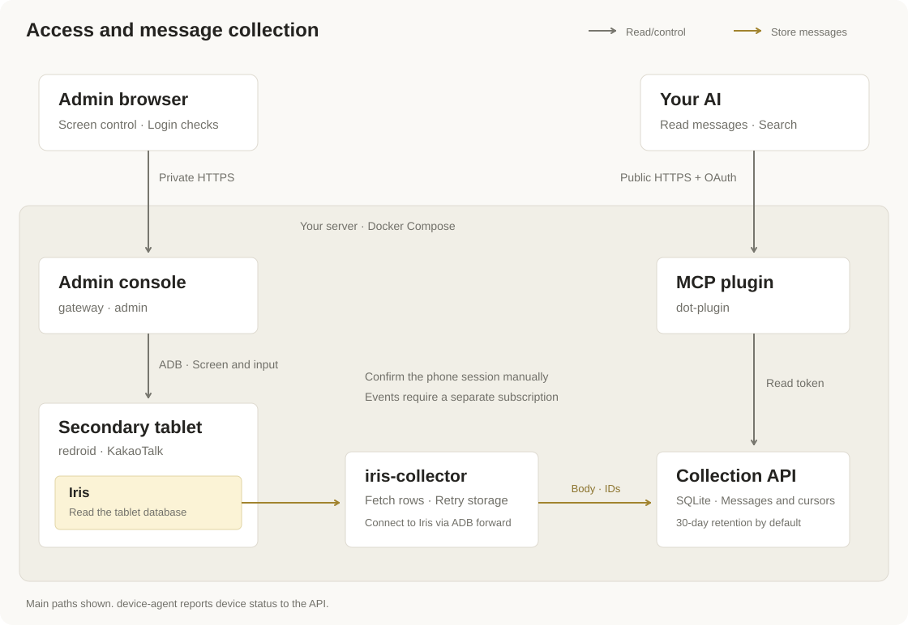

# 시스템 구조

[README](../README.md) · [Iris 구현](iris.md) · [API](api.md)

계정 하나와 redroid 인스턴스 하나를 운영하며, Iris로 태블릿의 카카오톡 DB를 읽어 수집합니다.

아래는 선택 사항인 공용 HTTPS 구성입니다. 기본 관리 화면은 localhost 또는 SSH 포워딩으로 접속하며, AI는 공개 HTTPS 대신 OpenAI 터널이나 stdio로 연결할 수도 있습니다. [연결 방식별 그림](../README.md#connect-your-ai)을 참고하세요.

[구조도 원본](assets/architecture.svg) · [메시지 흐름](assets/message-flow.svg)

## 서비스별 역할

| 서비스 | 역할 | 받는 키 |
| --- | --- | --- |
| `redroid` | Android 실행. 유일한 특권 컨테이너 | 없음 |
| `iris-collector` | 이미지의 Iris 설치·시작, 승인 확인, 페이지 조회와 순서대로 저장, 이름 갱신 | `ingest_token` |
| `api` | 인증, 중복 제거, 메시지·커서의 원자적 저장, 조회, 보관 기간 정리 | `ingest_token`, `read_token`, `device_token`, `backup_key` |
| `device-agent` | ADB·Android 상태 보고, 키보드 앱 갱신 | `device_token` |
| `gateway` | 비공개 HTTPS 및 API·관리 화면 라우팅 | `tls_cert`, `tls_key` |
| `admin` | 패스키 로그인, 운영 현황, 설정 진행, 연결·이벤트 관리, 제한된 화면·입력 제어, 로그인 확인과 수집 승인 | `admin_token`, `read_token`, `mcp_approval_token` |
| `dot-control` | 비공개 패스키 관리, OAuth·터널 승인과 철회, 활동 정보, 대화 이벤트 정책 | `mcp_storage_key`, `mcp_approval_token`, `mcp_passkey_token` |
| `dot-plugin` | 패스키 검증, 명시적 OAuth 동의, 원격 MCP, 선택적 이벤트 전달 | `read_token`, `mcp_link_key`, `mcp_storage_key`, `mcp_passkey_token` |
| `dot-ingress` | 관리 화면·MCP 공용 진입점. MCP 경로에서 관리 쿠키 제거 및 내부 경로 차단 | 없음 |
| `admin-local` | 선택적 루프백 전용 관리 진입점. 정확한 localhost Host 확인 | 없음 |
| `dot-tunnel` | 개인 OpenAI 터널용 비공개 MCP 리스너. 포트를 공개하지 않음 | `read_token`, `mcp_storage_key`, `mcp_passkey_token`, `mcp_tunnel_authorization` |
| `openai-tunnel` | 외부로 연결하는 OpenAI 터널 클라이언트 | `openai_tunnel_api_key`, `mcp_tunnel_authorization` |
| 호스트 설정 서비스 | Compose 밖의 systemd 등에서 실행. 비공개 Unix 소켓으로 정해진 연결 작업만 처리 | — |
| `adb-init` | Android 시작 전에 수집기 공개 키 두 개를 오프라인 등록 | 없음 |
| `bootstrap` | 일회성 기기 작업(`python -m device.cli`): 새 태블릿 등록, CLI 승인 | 없음 |
| `mcp` | 클라이언트가 실행하는 stdio 어댑터 | `read_token` |

키 파일과 용도는 [키 관리](security.md#key-management)를 참고하세요.

Iris는 별도 Compose 서비스가 아니라 redroid 안의 `app_process`로 실행됩니다. 키보드 앱은 관리 화면의 웹 텍스트 입력만 제공하며 알림 접근 권한이 없습니다. Android가 활성화한 키보드를 앱 ID로 저장하므로 앱 ID는 `dev.kakaocollector.bridge`를 유지하고, 코드 패키지는 `dev.kakaotalkbridge.android`입니다. `device-agent`는 시작하면 설치된 키보드 앱을 이미지의 빌드와 SHA-256으로 비교해 다르면 다시 설치하고, 키보드로 사용 중이었다면 다시 켭니다.

## 로그인과 수집 승인

1. 새 태블릿의 한국어 환경과 Aurora를 준비합니다. 카카오톡 설치 후 서명을 검증하고 키보드 앱을 설치하며 root 전용 `/data/kakaotalk-bridge/enrollment.json`에 등록 정보를 만듭니다. 수집은 잠긴 상태로 시작합니다.
2. 관리 화면의 **카카오톡 로그인**은 로그인 화면이 보이는 동안 **다른 기기와 함께 사용** 선택 여부를 표시합니다. 로그인 버튼을 누르거나 입력하지 않습니다.
3. 운영자가 태블릿에서 직접 로그인합니다. 관리 화면은 카카오톡 `LocalUser_DataStore`의 사용자 ID(`memochat_user_id`, `old_user_id`)로 로그인을 자동으로 확인합니다. 승인 전에는 운영자가 태블릿을 조작하지 않는 동안 약 15초마다 다시 점검합니다. 옵션 화면을 점검하기 전에 로그인했더라도 휴대폰 로그인이 유지되면 승인할 수 있습니다.
4. 운영자가 **휴대폰의 카카오톡 로그인이 유지되고 있습니다**를 선택하고 **메시지 수집 시작**을 누르면 로그인된 계정 ID, Android 지문, 휴대폰 확인 시각을 등록 정보에 저장합니다. CLI에서는 `docker compose --profile setup run --rm bootstrap approve --phone-session-active`를 사용합니다.
5. 태블릿의 계정 ID가 승인한 계정과 다르거나 확인되지 않을 때(로그인 전, 두 키의 값이 다름), Android 지문이 바뀌었을 때, 휴대폰 로그아웃이 기록되었을 때 수집을 멈춥니다. 휴대폰 로그아웃 기록은 승인을 지웁니다. 같은 계정이면 카카오톡 업데이트는 승인에 영향을 주지 않습니다. 다시 승인하려면 휴대폰을 확인하고 **메시지 수집 시작**을 다시 누르세요.

0.1.0에서 승인한 등록 정보는 업데이트 후 태블릿에 로그인된 계정으로 승인을 이어받습니다. 그때 태블릿의 계정을 읽을 수 없으면 다시 승인해야 합니다.

계정 확인은 의도하지 않은 변경을 알아차리기 위한 장치이며 보안 경계가 아닙니다. 다시 승인하면 그때 로그인된 계정으로 바뀝니다. 로그아웃·계정 전환 뒤 카카오톡이 이 저장소에 남기는 값은 실제 기기에서 확인하지 않았습니다.

태블릿 모델명과 해상도만으로 동시 로그인을 허용하지 않습니다. 휴대폰 확인 시각은 운영자의 수동 기록이며 원격 감시 결과가 아닙니다.

관리 화면은 선택적 AI 연결과 독립적으로 **준비 → 로그인 → 수집**을 안내합니다. 수집 중에는 수집기 상태, 원격 도구 활동, 수동 휴대폰 확인을 표시합니다. 태블릿 점검은 60초 또는 기기 조작 후 만료됩니다. 마지막 승인 상태 표시는 남기되 관련 작업에는 새 점검을 요구합니다. 태블릿 화면을 접으면 화면 갱신만 멈추고 수집은 계속됩니다.

## 연결 설정과 활동

웹 화면에서 사용할 곳과 연결 방식을 선택하면 검증된 작업만 호스트 설정 서비스로 전달합니다. 관리 컨테이너에는 Docker 소켓이 없습니다. 설정 서비스는 서비스와 설정을 준비하고 정해진 진행 안내와 작업 상태를 저장합니다. 점검 이외의 작업이 성공하면 선호 연결 방식을 별도로 저장합니다. 진행·실패·중단된 작업은 화면을 다시 열어 확인할 수 있고, 중단된 변경은 직접 재시도해야 합니다.

HTTPS·터널 연결 안내는 마지막 작업이 아닌 저장된 설정에서 가져옵니다. 점검이나 실패 후에도 안내를 유지하되 설정 저장을 실제 연결 성공으로 표시하지 않습니다. [설정 보안](security.md#web-connection-setup)을 참고하세요.

원격 도구 호출이 성공하면 MCP는 `dot-state`의 승인 ID별 `connection_activity`에 `last_tool_at`만 저장합니다. 승인 정보 자체를 다시 쓰거나 인수·메시지 내용을 저장하지 않습니다. 활성 OAuth·터널 승인에 대해 시각을 표시하며, 도구 목록 조회와 실패한 호출은 갱신하지 않습니다. 새 승인은 이전 활동을 이어받지 않습니다. 이 기록은 서버 점검, 이벤트 전달, 로컬 stdio 호출과 구분합니다.

## 저장과 재시도

Iris는 고정 SELECT로 한 번에 최대 200행(약 2MB)을 읽어 복호화합니다. Python 수집기는 페이지를 최대 100행·768KiB 요청으로 나눠 순서대로 보냅니다(API 요청 본문 제한 1MiB). 서버는 요청 안의 행을 순서대로 커밋하며 각 행과 Iris 커서를 같은 SQLite 트랜잭션에 저장합니다. 거부된 첫 행에서 멈추고 나머지 행은 `not_processed`로 응답하므로 커서는 저장되지 않은 행을 건너뛰지 않습니다. 응답이 유실되면 수집기는 서버 커서를 다시 조회해 이어서 보냅니다.

Iris가 해독하지 못한 행(`decrypt_failed`, `metadata_unreadable`, `unreadable`)과 서버가 형식 오류로 거부한 행(`invalid_row`)은 본문 없는 건너뛰기 기록으로 저장하고 다음 행을 계속 수집합니다. 건너뛴 수는 `/v1/status`의 `coverage.skipped_rows`에 표시하며 암호문을 메시지로 저장하지 않습니다. 이벤트 ID 충돌, 같은 위치의 다른 행, DB 교체, ID 역행은 건너뛰지 않고 수집을 멈춥니다.

기기 확인은 ADB 호출 한 번으로 등록 정보, Android 지문, 태블릿 설정, 카카오톡 계정을 읽습니다. 수집기는 페이지 조회 전과 행이 있는 페이지를 받은 뒤 확인하며 행마다 확인하지 않습니다. Iris도 요청마다 승인한 계정, Android 지문, 휴대폰 로그아웃 기록을 검사합니다.

메시지 ID는 등록 세대, DB 식별자, 로그 ID로 만듭니다. 본문이 같아도 로그 ID가 다르면 별개입니다. 기존 행의 수정·삭제는 동기화하지 않습니다.

## 네트워크와 복구

기본 구성은 내부 HTTPS API 게이트웨이와 localhost·SSH용 루프백 HTTP 관리 화면을 제공합니다. AI 연결은 선택 사항입니다. 로컬 관리 진입점은 정확한 localhost Host만 허용하며 관리 외 경로를 거부합니다. 선택적 공개 HTTPS 프록시는 dot-ingress만 향하고, `/admin/*`는 admin으로, OAuth·MCP는 dot-plugin으로 전달합니다.

Android 네트워크(`device-net`)에는 redroid와 ADB를 쓰는 `iris-collector`, `device-agent`, `admin`, `bootstrap`만 참여합니다. 게이트웨이는 비공개 HTTPS 포트 공개용 `gateway-edge-net`과 API용 내부 네트워크만 사용하며 Android 네트워크에 참여하지 않습니다. 수집기는 내부 네트워크에서 API에 직접 저장하므로 `GATEWAY_IP` 설정은 사용하지 않습니다.

별도 Docker 네트워크는 공개 앱이 Android·관리 제어에 직접 접근하지 못하게 하면서 읽기 API와 패스키 검증만 허용합니다. ingress는 루프백 포트용 외부 네트워크와 dot-plugin·admin용 내부 연결을 사용하며 기기·API·제어 네트워크에는 참여하지 않습니다. 공개 MCP 프로세스는 관리 ingress 네트워크에 참여하지 않습니다. 쿠키 경계와 남은 위험은 [보안](security.md)을 참고하세요.

redroid의 자동 재시작은 꺼져 있습니다. 선택적 호스트 감독 서비스가 30분에 최대 3회까지 redroid를 다시 시작합니다. 백업과 복구는 [운영](operations.md)을 따르세요.

## 선택적 이벤트

자동 구독은 없습니다. 관리 화면의 **대화 이벤트**에서 공용 허용 목록을 관리하며 모든 방은 기본 꺼짐입니다. 클라이언트가 별도로 구독해야 허용한 방의 활성화 커서 이후 새 행 식별자를 전달합니다. 방을 끄면 대기 전송을 취소하고 미처리 조회에서도 제외합니다. 이벤트는 AI를 깨우는 신호이고 본문은 MCP 도구로 읽습니다. 소비자별 처리 커서는 카카오톡 읽음 상태와 독립적입니다. [이벤트](events.md)를 참고하세요.
